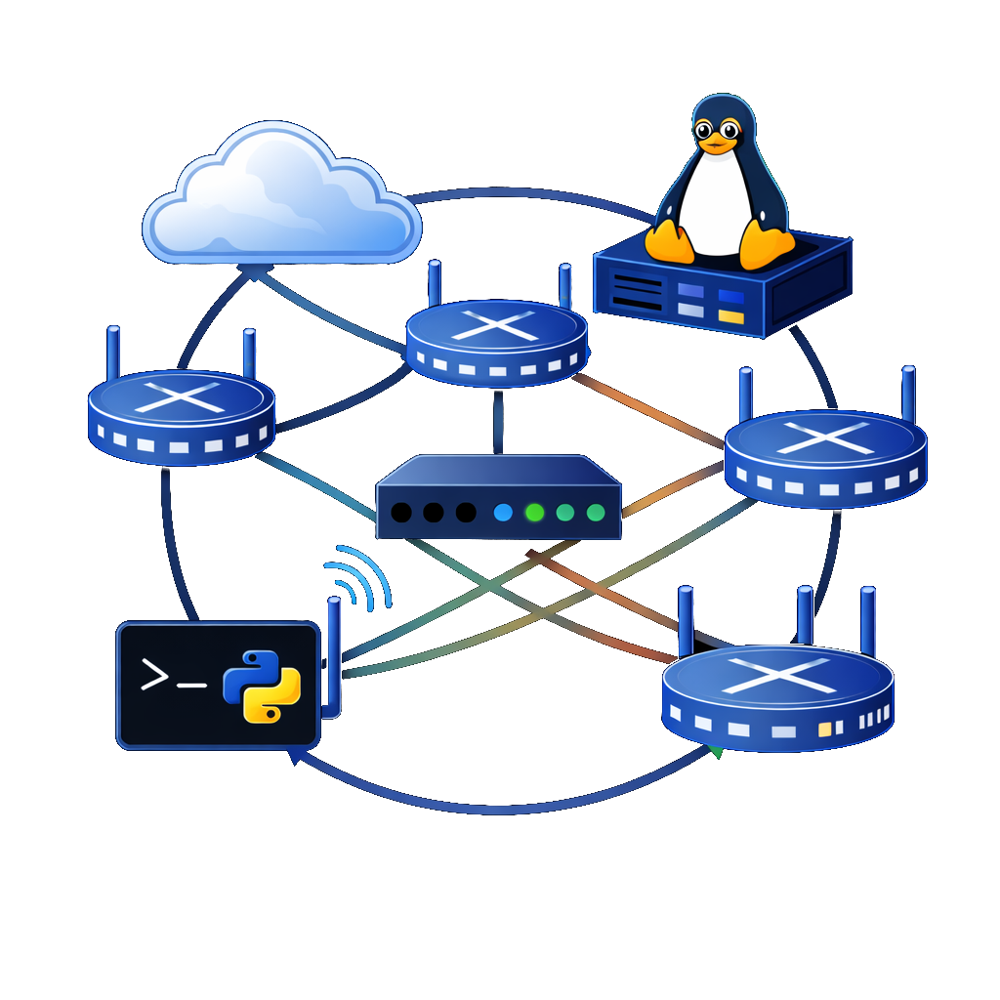
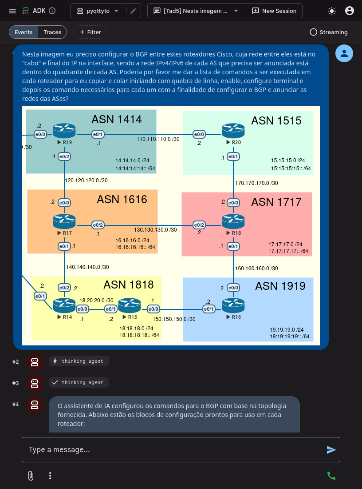
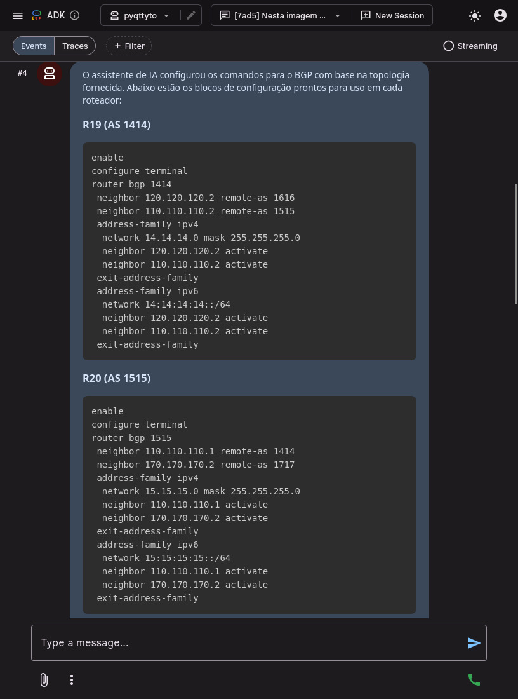
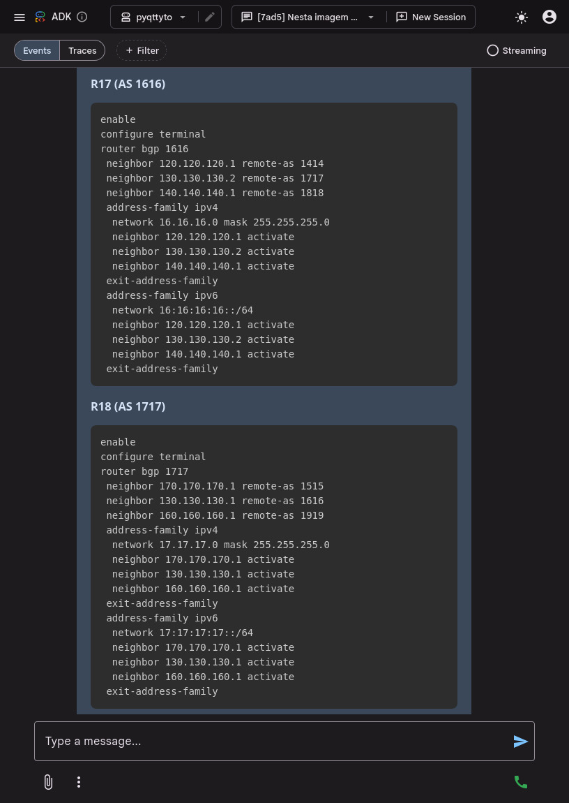
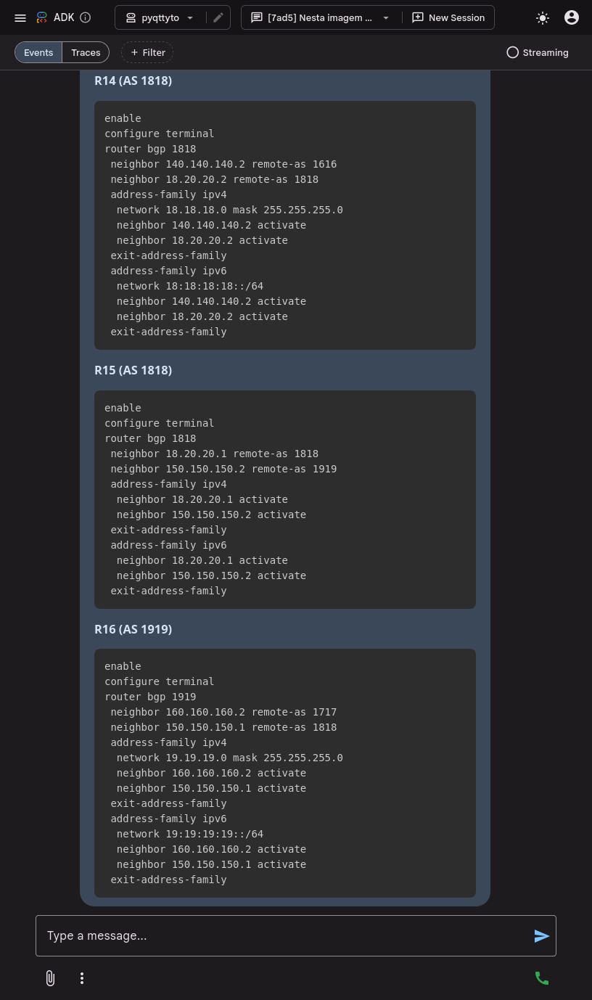
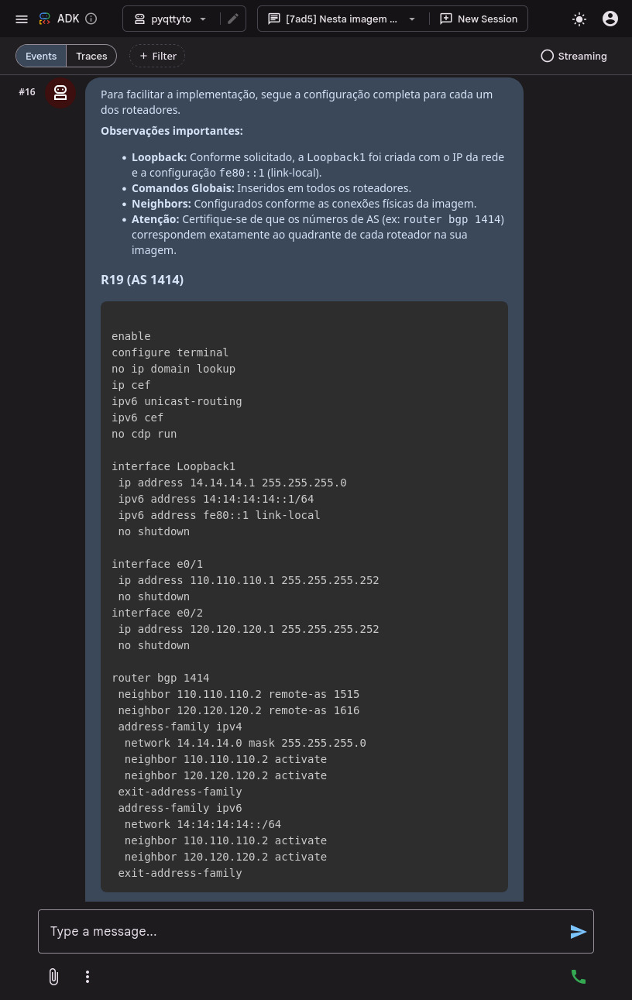
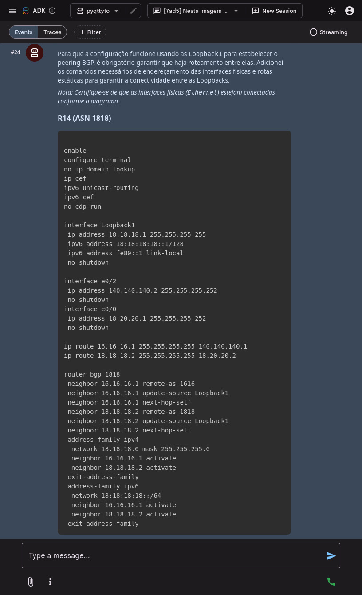

# Pyqttyai

> **Py**thon + **Q**t + **TTY** + **AI**
> A study companion for network automation, lab topology visualization, and per-device scripting.

Pronounced *"paiquitieiai"* (PT-BR friendly).
Originally **Pyqttyia** (IA = *Inteligência Artificial* in Portuguese), later renamed to **Pyqttyai** (AI = Artificial Intelligence).

<p align="center">
  
</p>

---

## 🚀 Motivation

This project aims to combine the study of **Python** and **Qt** with **networking courses**.

It can be used with either real equipment or virtual labs, such as those built in **EVE-NG**.

Ideal for studies on network certifications like **CCNA / CCNP / MikroTik / Fortinet** and others, as well as for real-world applications.

---

## 🎯 Purpose

Pyqttyai is a personal learning project built to support studies in:

- **PyQt6** — desktop GUI development with Qt 6
- **EVE-NG** — network emulation lab environment
- **Cisco CCNP** — routing, switching, and troubleshooting
- **Network automation** — via Telnet/SSH
- **AI-assisted scripting** — in future stages

The app provides a single workspace where the user can:

1. **Visualize** the lab topology (image-based, exported from EVE-NG).
2. **Edit** configuration scripts per device (one editor per tab).
3. **Connect** to each device via Telnet/SSH in an embedded TTY console.
4. **Send** scripts directly from the editor to the live console.
5. **Translate** natural human language into technical device commands (NLP).
6. *(Future)* Use **AI** to generate, review, or explain configurations across multiple router manufacturers.

---

## 🏗️ Initial Architecture

```
Pyqttyai/
├── main.py                     # Entry point
├── pyqttyai/
│   ├── __init__.py
│   ├── app.py                  # QApplication setup
│   ├── widgets/
│   │   ├── __init__.py
│   │   ├── main_window.py      # Main window (left/right splitter)
│   │   ├── topology_viewer.py  # Image viewer with zoom/pan
│   │   ├── device_tab.py       # Tab with editor + terminal
│   │   ├── script_editor.py    # Editor with syntax highlighting
│   │   └── tty_console.py      # TTY console (telnet/ssh)
│   ├── core/
│   │   ├── __init__.py
│   │   ├── session.py          # Connection manager (telnet/SSH)
│   │   ├── device.py           # Device model
│   │   └── script_runner.py    # Runs scripts (full or selection) with per-line delay
│   └── resources/
│       ├── styles.qss
│       └── icons/
├── topologies/                 # Topology images
├── scripts/                    # Saved scripts
├── requirements.txt
└── README.md
```

---

## 🧩 High-Level Layout

```
┌──────────────────────────────────────────────────────────────────────┐
│  📂 Topology  ➕ Add Device  💾 Save  📁 Load                        │
├────────────────────┬─────────────────────────────────────────────────┤
│                    │ [🟢📡 R1-Core]  [🔴📡 SW1-Access]  [🟢🔒 FW1]   │
│                    ├─────────────────────────────────────────────────┤
│                    │ ⚡Connect ✖Disconnect ▶Send Script  Delay:500ms │
│   🕸️ Topology      │─────────────────────────────────────────────────│
│      Viewer        │ 📝 Script Editor                                │
│                    │  1 │ enable                                     │
│   (zoom + pan      │  2 │ configure terminal                         │
│    image)          │  3 │ hostname R1-CORE                           │
│                    │  4 │ interface Gi0/0                            │
│                    │  5 │   ip address 10.0.0.1 255.255.255.0        │
│                    │  6 │   no shutdown                              │
│                    │  7 │ end                                        │
│                    │─────────────────────────────────────────────────│
│                    │ 🖥 TTY Console                                   │
│                    │ --- Connected! ---                              │
│                    │ R>enable                                        │
│                    │ R#configure terminal                            │
│                    │ R(config)#hostname R1-CORE                      │
│                    │ R1-CORE(config)#_                               │
└────────────────────┴─────────────────────────────────────────────────┘
```

- **Left panel:** topology image viewer (zoom, pan, fit-to-window).
- **Right panel:** `QTabWidget`, one tab per device.
- **Each tab:** vertical `QSplitter` → editor on top, TTY on bottom.

---

## 🙏 Special Thanks

A heartfelt thank you to **Thiago G. Figueiredo** for his invaluable contributions to this project:

- 🧪 **EVE-NG Labs** — designed and shared the network topologies used throughout development, demos, and documentation videos.
- 🖼️ **Topology Images** — provided the visual diagrams that power the image-based device mapping (v0.2) and the multi-vendor lab walkthroughs.
- 🛠️ **Router Configurations** — authored the per-device scripts (Cisco IOS, routing protocols, BGP/OSPF/EIGRP setups) that became the reference workloads for testing **Send All**, **Send Each**, and the v0.5 NLP rules engine.
- ✅ **Testing & Validation** — exercised every release across real lab scenarios, surfacing the edge cases that shaped v0.1's protocol handler robustness and v0.4's parallel-execution model.

Without Thiago's labs, configs, and patient teaching and testing, Pyqttyai would still a wish for replace a Putty single-tab terminal. **Obrigado, Thiago!** 🇧🇷🎯

---

## 🗺️ Roadmap (Documentation Versions)

| Version | Scope                                                                       |
|---------|-----------------------------------------------------------------------------|
| v0.0    | Project overview, vision, and layout.                                       |
|         | Requirements, dependencies, and project structure.                          |
| v0.1    | Image visualization, EVE-NG integration, script editor, and connections.    |
|         | Save/Load workspace: device metadata, scripts, image paths, and configs.    |
| v0.2    | Image map to associate each device with a tab, without EVE-NG dependency.   |
| v0.3    | Windows adjustments and Telnet/SSH service configuration for EVE-NG.        |
| v0.4    | "Send All" feature to broadcast one script to selected devices.             |
|         | Additional feature to send each device's own script to selected devices.    |
| v0.5    | AI-based voice-to-text transcription using Whisper models.                  |
|         | NLP: processing human natural language into technical output (via regex).   |
| v0.6    | **Pyqttyto**: AI integration (next step) — assistant for reading            |
|         | topology images, configs, logs, and debug output; troubleshooting;          |
|         | live analysis; conversion between vendor command languages; and more.       |

---
---

## v0.1 — 📦 Pyqttyai v0.1 — Image Visualization, EVE-NG Integration, Script Editor & Connections

> **Status:** ✅ Released
> **Demo video:** *Watch the full v0.1 walkthrough on YouTube:*

🇧🇷 Para a versão em Português, clique aqui: https://www.youtube.com/watch?v=rytvkIbfXvY

🇺🇸 For the English version, click here: https://www.youtube.com/watch?v=izYU7C3n6Yk


This first functional release delivers the **core workspace** of Pyqttyai: a desktop GUI where the user can visualize lab topologies, connect to network devices via Telnet/SSH, edit per-device scripts, and orchestrate multi-device command execution — all integrated with **EVE-NG** through the URL protocol handler.

---

### 🎯 Scope of v0.1

- 🖼️ **Topology image viewer** with zoom, pan, and fit-to-window.
- 📝 **Per-device script editor** with syntax highlighting and drag-and-drop.
- 🖥️ **Embedded TTY console** supporting Telnet and SSH.
- ⚡ **EVE-NG integration** via clickable devices in the EVE-NG web UI.
- 📥 **Bulk device import** directly from an EVE-NG lab via REST API.
- 💾 **Save/Load workspace** preserving devices, scripts, and image path.
- 📡 **Send All** — broadcast commands to multiple selected devices.
- 🎯 **Send Selection / Send Line** — granular script execution control.

---

### 🚀 Workflow Overview

```
┌──────────────┐    click device     ┌──────────────────┐
│   EVE-NG     │ ──────────────────► │    Pyqttyai      │
│  (web UI)    │  telnet://ip:port   │  (auto-opens     │
│              │                     │   matching tab)  │
└──────────────┘                     └──────────────────┘
                                              │
                                              ▼
                                     ┌──────────────────┐
                                     │ Script Editor    │
                                     │       +          │
                                     │ Live TTY Console │
                                     └──────────────────┘
```

When the user clicks a device inside EVE-NG, the browser invokes the `telnet://` URL handler, which is registered on the OS to launch Pyqttyai. The app receives the protocol, IP, and port, then:

1. If a tab already exists matching those parameters → **focuses it**.
2. If not → **creates a new tab** with the device metadata pre-filled.

---

### 🧩 Features in Detail

#### 1. 🖼️ Topology Viewer (left panel)

A pannable, zoomable image viewer for static topology diagrams.

| Action | Input |
|--------|-------|
| Zoom in/out | Mouse wheel |
| Pan horizontally | Shift + wheel  *or*  two-finger swipe (trackpad) |
| Pan freely | Click and drag |
| Fit to window | Toolbar button |

> 💡 **Tip:** When using EVE-NG, the image is optional — the EVE-NG web UI itself becomes the visual topology. The viewer shines for **physical labs** without an emulator.

---

#### 2. 📑 Device Tabs (right panel)

Each device gets a dedicated tab with:

- A **colored status dot**: 🔴 disconnected / 🟢 connected.
- A **rename** option (double-click the tab).
- Connection metadata: **protocol** (telnet/ssh), **IP**, **port**, plus **user/password** for SSH.
- A vertical split between **Script Editor** (top) and **TTY Console** (bottom).

---

#### 3. 📝 Script Editor

A lightweight code editor with:

- ✅ Syntax highlighting for common Cisco / network commands.
- ✅ **Drag-and-drop** support:
  - From the **TTY console** (capture command outputs into the editor).
  - From **external sources** (browser, other editors, plain text).
- ✅ Three execution modes:
  - **▶ Send Script** — send the entire editor content.
  - **▶ Send Selection** — send only the highlighted text.
  - **▶ Send Line** — send only the line where the cursor is positioned.
- ✅ Configurable **per-line delay** (default: 500 ms) to avoid overwhelming devices.

---

#### 4. 🖥️ TTY Console

Behaves like a normal terminal:

- Type commands directly with full echo.
- `Tab` for autocompletion (device-side).
- `?` for context-sensitive help (Cisco-style).
- **Select text and drag** it into the script editor — perfect for capturing outputs.

Supported protocols: **Telnet** and **SSH** (with username/password; key-based auth planned for later versions).

---

#### 5. 📥 EVE-NG Lab Import

Bulk-import every device from an EVE-NG lab via REST API:

| Field | Example |
|-------|---------|
| EVE-NG IP | `192.168.0.10` |
| Port | `80` (HTTP) |
| User / Password | `admin` / `eve` |
| Lab name | `LAB_BGP_CCNP_ENARSI_AULA` |

- Device order: **routers (R*)** → **switches (SW*)** → others (alphabetical).
- Devices that already exist (matched by **protocol + IP + port**) are **not overwritten**.
- ⚠️ EVE-NG only accepts **one admin session at a time**; the app reconnects automatically after fetching.

---

#### 6. ⚡ Connect All & Send All

Two top-bar actions for multi-device operations:

- **🔌 Connect All** — opens Telnet/SSH sessions for every tab.
- **📡 Send All** — broadcasts a script to all **selected and connected** devices.
  - Disconnected tabs cannot be selected.
  - Each device respects its **own per-line delay**.

> ⚠️ **Caveat:** Selecting heterogeneous devices (e.g., Cisco routers + Linux + VPCs) when sending vendor-specific commands will produce "noise" on the wrong targets. Always curate the selection before broadcasting.

---

#### 7. 💾 Workspace Save/Load

Workspaces are stored as JSON in the `workspaces/` directory and include:

- All device tabs (protocol, IP, port, credentials, label).
- Each device's **saved script**.
- The **topology image path** (if any).
- UI state (active tab, split sizes — when applicable).

Reopening a workspace restores **everything exactly** as it was saved, including unsaved-but-typed script content.

---

### 🐛 Known Issues / Quirks

These appeared during the v0.1 demo and are documented for transparency:

| # | Issue | Mitigation |
|---|-------|------------|
| 1 | Sending `show running-config` may "eat" the `c` of a following `configure terminal`. | Increase per-line delay or use **Send Line** for sensitive commands. |
| 2 | Broadcasting Cisco IOS commands to Linux/VPC tabs produces shell errors. | Deselect non-Cisco tabs before **Send All**. |
| 3 | EVE-NG drops the admin session when Pyqttyai authenticates. | The app reconnects on the next Fetch automatically. |
| 4 | `show ip route` from privileged-exec inside `config` mode requires the `do` prefix. | User-side awareness; future versions may auto-detect mode. |

---

### 🛠️ Tech Stack (v0.1)

- **GUI:** PyQt6
- **Telnet:** `telnetlib3` (asyncio)
- **SSH:** `paramiko`
- **EVE-NG REST:** `requests`
- **Persistence:** JSON
- **Protocol handler:** OS-level registration of `telnet://` (Windows / Linux `.desktop`)

---

### 🔮 What's Next (v0.2 preview)

- 🗺️ **Image-based device mapping** — click a router on the topology image to focus its tab, **without EVE-NG**.
- 📐 Coordinate editor to draw clickable hotspots over the topology.
- 🏷️ Persistent device-to-coordinates association (stored alongside the workspace JSON).

---

### 📺 Demo Video

*Watch the full v0.1 walkthrough on YouTube:*

🇧🇷 Para a versão em Português, clique aqui: https://www.youtube.com/watch?v=rytvkIbfXvY

🇺🇸 For the English version, click here: https://www.youtube.com/watch?v=izYU7C3n6Yk

Subtitles available in **Portuguese (BR)** 🇧🇷 and **English** 🇺🇸.

---
---

## v0.2 — 🗺️ Pyqttyai v0.2 — Image-Based Device Mapping (EVE-NG-independent)

> **Status:** ✅ Released
> **Demo video:** *Watch the full v0.2 walkthrough on YouTube*

🇧🇷 Para a versão em Português, clique aqui: https://www.youtube.com/watch?v=hU5b_QCu3s8

🇺🇸 For the English version, click here: https://www.youtube.com/watch?v=BRPQj5ulKC4

This release introduces **image-based device mapping**, allowing users to click directly on a router, switch, or any device drawn on the **topology image** to focus its corresponding tab — **without depending on EVE-NG**. This is the foundation for using Pyqttyai with **physical labs**, static diagrams, or any environment where EVE-NG isn't available.

---

### 🎯 Scope of v0.2

- 🗺️ **Clickable hotspots** over the topology image, mapped to device tabs **by name**.
- 📐 **Coordinate editor** to add, resize, and reposition hotspots visually.
- 🤖 **AI-assisted hotspot generation** — let an LLM produce an initial JSON of coordinates from the topology image (or add them manually).
- 🏷️ **Persistent topology map** stored as JSON alongside the workspace.
- 🔗 **Tab matching by name** — unlike the EVE-NG flow (which matches by `protocol + IP + port`), the image map uses the **device name**, so names must be unique within a workspace.
- ✏️ **Batch + fine adjustments** workflow for quickly aligning AI-generated coordinates.

*Note: For topologies with few devices, this is very easy to do manually.*

---

### 🚀 Workflow Overview

```
┌────────────────────┐   AI generates    ┌─────────────────────┐
│ Topology Image     │ ─────────────────►│ topology.json       │
│ (PNG/JPG)          │   coordinates     │ (hotspots + sizes)  │
└────────────────────┘                   └─────────────────────┘
           │    │                                   │
           │    │  ┌───────────────────┐            │
           │    └─►│ Enable Map editor │            │
           │       │                   │            │
           │       │  Click and drag   │            │
           │       │  Add a reference  │            │
           │       └───────────────────┘            │
           │                │                       │
           ▼                ▼                       ▼
┌──────────────────────────────────────────────────────────────┐
│                       Pyqttyai v0.2                          │
│    Click on a device in the image → focuses its device tab   │
│             (matched by name — unlike EVE-NG,                │
│              which uses protocol + IP + port)                │
└──────────────────────────────────────────────────────────────┘
```

When the user clicks anywhere inside a mapped hotspot, Pyqttyai locates the matching tab using the **device name** and brings it to focus — bypassing EVE-NG entirely.

> 🔁 **Two matching strategies coexist in Pyqttyai:**
> - **EVE-NG click** → handler receives `telnet://<ip>:<port>` → tab matched by **`protocol + IP + port`** (name is irrelevant).
> - **Image map click** → hotspot carries a **name** → tab matched by **name** (`protocol + IP + port` is irrelevant).

---

### 🧩 Features in Detail

#### 1. 🗺️ Topology Map JSON

The hotspot data is stored as a separate JSON file (e.g., `topologies/LAB_BGP_CCNP_ENARSI_AULA.json`) with one entry per device:

```json
{
  "devices": [
    {
      "name": "R1",
      "x": 120,
      "y": 240,
      "width": 60,
      "height": 60
    }
  ]
}
```

- **Coordinates `x` / `y`** are in image pixels (relative to the topology PNG/JPG).
- **`width` / `height`** define the clickable rectangle around each device.
- The file is **loadable** via *Map → Load Topology Map* and **savable** via *Map → Save Topology Map*.
- The map is **auto-loaded** when the topology image is loaded, as long as it sits beside it with the same base name and a `.json` extension.

---

#### 2. 🤖 AI-Assisted Coordinate Bootstrap

To skip the tedious step of measuring pixel positions, the user can:

1. Upload the topology image to any vision-capable LLM.
2. Request a JSON listing each device label with `x`, `y`, `width`, and `height`.
3. Save the JSON and load it directly via *Load Topology Map*.

> 💡 **Reality check:** AI-generated coordinates are rarely pixel-perfect. They typically come with a **uniform offset** or **scaling factor**, which is why the in-app **coordinate editor** is essential.

---

#### 3. ✏️ Coordinate Editor

Toggle the **Editor** button to enable interactive editing:

| Action | Behavior |
|--------|----------|
| Click and drag on empty area | Adds a new hotspot |
| Hover over a hotspot | Highlights the device |
| Click a hotspot | Selects it for editing |
| Drag corners / edges | Resizes the hotspot |
| Drag center | Moves the hotspot |
| Rename in side list | Updates the device label |
| Save | Overwrites the topology JSON |

> 💡 **Pro tip:** When AI-generated coordinates share a common offset, apply a **batch shift** first, then do **fine adjustments** on individual devices. This is dramatically faster than fixing each one from scratch.

---

#### 4. 🔗 Tab Matching: Why by Name?

A subtle but critical design choice: when a hotspot is clicked, Pyqttyai matches it to a tab using the **device name** — which is simple and intuitive for the user.

**Why not `protocol + IP + port` like the EVE-NG flow?**
The EVE-NG click path is driven by the URL handler, which only carries `telnet://<ip>:<port>` — there is **no name** in that payload, so matching must rely on the connection triple. The image map, on the other hand, is **authored by the user**, and humans naturally reason about devices by **name** ("click on R1"), not by IP/port. Matching by name keeps the editing experience intuitive.

**Practical consequence:** within a workspace using the image map, **device names must be unique**. If the user renames a tab after mapping (e.g., `SW7` → `SW7-Lower`), they must also update the corresponding entry in the topology JSON (or via the in-app editor) to keep the link working.

---

#### 5. 🖱️ Click-to-Focus Behavior

With the editor **disabled** (normal mode):

- 🟢 **Click on a mapped device** → focuses its tab on the right panel (matched by name).
- ⚪ **Click on an unmapped area** → does nothing.
- 🔄 **Re-clicking the same hotspot** → keeps the tab focused (idempotent).
- 🆕 **Tab doesn't exist yet?** → no auto-creation (use *Add Device* or EVE-NG import first).

---

### 🐛 Known Issues / Quirks

| # | Issue | Mitigation |
|---|-------|------------|
| 1 | AI-generated coordinates may be uniformly offset or scaled. | Apply a batch correction first, then fine-tune individually. |
| 2 | Renaming a tab **breaks** the image-map link, because matching is by name. | Rename the device in the topology JSON (or via the in-app editor) to match the new tab name. |
| 3 | Two tabs with the **same name** will cause the image map to focus only the first match. | Keep device names unique within a workspace. |
| 4 | Very large topology images can be slow to pan/zoom. | Downscale images to ≤ 2048 px on the longest side. |

---

### 🛠️ Tech Stack (v0.2 additions)

- **Hotspot rendering:** `QGraphicsRectItem` overlays on the `QGraphicsScene`
- **JSON schema:** flat list of devices with absolute pixel coordinates
- **Editor mode:** stateful toggle in `topology_viewer.py`
- **Persistence:** JSON sidecar next to the topology image (`<image_name>.json`)
- **Matching strategy:** **device name** (image map) vs. **protocol + IP + port** (EVE-NG URL handler)

---

### 📺 Demo Video

*Watch the full v0.2 walkthrough on YouTube*

🇧🇷 Para a versão em Português, clique aqui: https://www.youtube.com/watch?v=hU5b_QCu3s8

🇺🇸 For the English version, click here: https://www.youtube.com/watch?v=BRPQj5ulKC4

Subtitles available in **Portuguese (BR)** 🇧🇷 and **English** 🇺🇸.

---
---

## v0.3 — 🪟 Pyqttyai v0.3 — Windows Polish & Protocol Handler Integration

> **Status:** ✅ Released
> **Demo video:** *Not recorded for this release — cosmetic + platform-integration update.*

This release focuses on **Windows-side integration** and **UI polish**. There are no new core features, but it makes Pyqttyai feel like a native desktop app on Windows: clickable `telnet://` and `ssh://` links in any browser (including EVE-NG) now open directly in Pyqttyai, and the entire UI received a consistent visual pass.

---

### 🎯 Scope of v0.3

- 🪟 **Windows URL protocol handlers** for `telnet://` and `ssh://`, registered per-user via `HKEY_CURRENT_USER`.
- 🔄 **Self-healing registry sync** — Pyqttyai re-points the handler to its current executable automatically whenever it moves or is reinstalled.
- 🎨 **Cosmetic adjustments** — fonts, sizes, icons, color palette, and spacing refinements across all widgets.
- ⌨️ **Keyboard shortcuts** added/normalized for common actions.
- 🖼️ **Icon set** — multi-resolution app icon (`16, 24, 32, 48, 64, 128, 256, 512, 1024`) plus `pyqttyai.ico` for Windows.

---

### 🚀 Workflow Overview

```
┌──────────────────────┐    telnet://ip:port    ┌────────────────────────┐
│ Browser / EVE-NG UI  │ ──────────────────────►│ Windows URL handler    │
└──────────────────────┘                        │ (HKCU\Software\Classes)│
                                                └───────────┬────────────┘
                                                            │
                                                            ▼
                                                ┌────────────────────────┐
                                                │ pythonw.exe main.py %1 │
                                                │   →  Pyqttyai opens    │
                                                │      matching tab      │
                                                └────────────────────────┘
```

On startup, Pyqttyai calls `sync_protocol_registry()` for both `telnet` and `ssh`. If the registry entry is missing or points to an outdated executable, it is rewritten transparently — no admin rights required, since everything lives under `HKEY_CURRENT_USER`.

---

### 🧩 Features in Detail

#### 1. 🪟 Telnet & SSH Protocol Handlers

Pyqttyai registers itself as the default handler for two URI schemes on Windows:

| Scheme | Registry Key | Purpose |
|--------|--------------|---------|
| `telnet://` | `HKCU\Software\Classes\telnet` | Open Telnet sessions from EVE-NG or any browser |
| `ssh://`    | `HKCU\Software\Classes\ssh`    | Open SSH sessions from any clickable link |

Each scheme contains:

- A default value: `URL:Telnet Protocol` / `URL:SSH Protocol`
- An empty `URL Protocol` marker (required by Windows to identify URI schemes)
- A `shell\open\command` subkey with the full command line, ending in `"%1"` to receive the clicked URL

The equivalent `.reg` file looks like this:

```reg
Windows Registry Editor Version 5.00

; --- Telnet Handler ---
[HKEY_CURRENT_USER\Software\Classes\telnet]
@="URL:Telnet Protocol"
"URL Protocol"=""

[HKEY_CURRENT_USER\Software\Classes\telnet\shell\open\command]
@="\"C:\\Path\\To\\pythonw.exe\" \"C:\\Path\\To\\Pyqttyai\\main.py\" \"%1\""

; --- SSH Handler ---
[HKEY_CURRENT_USER\Software\Classes\ssh]
@="URL:SSH Protocol"
"URL Protocol"=""

[HKEY_CURRENT_USER\Software\Classes\ssh\shell\open\command]
@="\"C:\\Path\\To\\pythonw.exe\" \"C:\\Path\\To\\Pyqttyai\\main.py\" \"%1\""
```

> 💡 **No admin rights needed.** All keys live under `HKEY_CURRENT_USER`, so the registration is per-user and doesn't require UAC elevation.

---

#### 2. 🔄 Self-Healing Registry Sync

The function `sync_protocol_registry(protocol)` in `pyqttyai/core/winreg_protocols.py` runs at startup and guarantees the registry always points to the **current** executable. This solves the classic "I moved the folder and now my links don't work" problem.

**Logic flow:**

1. Detect the current executable (`sys.executable`).
2. If it's a Python interpreter (e.g., `pythonw.exe`), build the command as:
   ```
   "C:\path\to\pythonw.exe" "C:\path\to\main.py" "%1"
   ```
   Otherwise (frozen `.exe`), use:
   ```
   "C:\path\to\Pyqttyai.exe" "%1"
   ```
3. Create/open `HKCU\Software\Classes\<protocol>` and write the description + `URL Protocol` marker.
4. Read the current value of `...\shell\open\command`.
5. **Only rewrite if the value has changed** — avoids unnecessary registry writes on every launch.

```python
if current_val != cmd_value:
    winreg.SetValueEx(cmd_key, "", 0, winreg.REG_SZ, cmd_value)
    print(f"Registry synced: {protocol} -> {cmd_value}")
```

This is called for both `telnet` and `ssh` on every Pyqttyai startup (Windows only).

---

#### 3. 🎨 Cosmetic Adjustments

A broad visual polish pass touching most widgets:

| Area | Change |
|------|--------|
| 🔤 **Fonts** | Standardized monospace font in the script editor and TTY console; tuned UI font sizes for readability |
| 📏 **Sizing** | Adjusted default window size, splitter ratios, and minimum widths for panels |
| 🎨 **Colors** | Harmonized palette across editor, console, tab headers, and status dots |
| 🖼️ **Icons** | New multi-resolution app icon (`pyqttyai_16.png` … `pyqttyai_1024.png`) and Windows `.ico` |
| 🧱 **Spacing** | Tightened margins/paddings in toolbars and dialogs |
| 🟢 **Status dots** | Refined connected/disconnected indicators on tabs |

---

#### 4. ⌨️ Shortcuts

Common actions received keyboard shortcuts for faster workflow (save, send script/selection/line, navigate tabs, toggle map editor, etc.), aligning Pyqttyai with typical desktop-app expectations.

---

### 🐛 Known Issues / Quirks

| # | Issue | Mitigation |
|---|-------|------------|
| 1 | Some browsers (Chrome/Edge) show a confirmation dialog the first time a `telnet://` or `ssh://` link is clicked. | Check **"Always allow"** to skip it on subsequent clicks. |
| 2 | If another app (e.g., PuTTY, SecureCRT) was previously registered as the default handler, Windows may keep asking which app to use. | Run Pyqttyai once after install — the self-healing sync re-registers it. Optionally set as default via Windows Settings → Apps → Default apps. |
| 3 | The handler is **Windows-only**. Linux uses a `.desktop` file (already shipped as `Pyqttyai.desktop`). | Use the `.desktop` file on Linux (registered via `xdg-mime`). |
| 4 | Moving the Pyqttyai folder while it's closed doesn't break anything — the next launch re-syncs the registry — but **other apps** that cached the path may fail. | Launch Pyqttyai once after moving the folder. |

---

### 🛠️ Tech Stack (v0.3 additions)

- **Registry access:** standard-library `winreg` (no third-party dependency)
- **Module:** `pyqttyai/core/winreg_protocols.py`
- **Entry point integration:** `sync_protocol_registry("telnet")` and `sync_protocol_registry("ssh")` called at startup (Windows only)
- **Scope:** `HKEY_CURRENT_USER` — per-user, no admin rights required
- **Icons:** PNG set + `pyqttyai.ico` under `images/`

---

### 📺 Demo Video

*No video for v0.3* — this release is a **cosmetic + platform-integration update** with no new user-facing workflows to demonstrate. The visual changes are visible across the v0.4 walkthrough.

---
---

## v0.4 — 📡 Pyqttyai v0.4 — Send All & Send Each

> **Status:** ✅ Released
> **Demo video:** *🎬 Watch the full v0.4 walkthrough on YouTube*

🇧🇷 Para a versão em Português, clique aqui: https://www.youtube.com/watch?v=7t6eOyddg0s

🇺🇸 For the English version, click here: https://www.youtube.com/watch?v=6sQQFr09WG4

This release introduces the **Send All** functionality: a single, central place from which you can push commands to **multiple devices at once**, either by broadcasting **one shared script** to all of them or by sending **each device's own script** to each device — all running in parallel.

---

### 🎯 Scope of v0.4

- 📡 **Send All** — broadcast a single script to many devices simultaneously.
- 📨 **Send Each** — send each device's own script to a selection of devices, all at the same time.
- 📚 **Reusable Script Library** — multiple persistent script tabs (Save, Exit, Disable CDP, BGP Summary, Show IP, …) stored **per workspace**.
- ✏️ **Renamable script tabs** via double-click for quick organization.
- 🪟 **Bring-window-to-front** when a `telnet://` / `ssh://` link is clicked from the browser/EVE-NG — no more Alt+Tab hunting.

---

### 🚀 Workflow Overview

```
┌─────────────────────────────────────────────────────────────────┐
│                         Send All Dialog                         │
│                                                                 │
│   ☑ R1   ☑ R2   ☑ R3   ☑ R8   ☑ R13   ☑ R14   ☑ R17             │
│   ───────────────────────────────────────────────               │
│   ☐ Use each device's own script                                │
│                                                                 │
│   [Save] [Exit] [No CDP] [BGP Summ.] [IPs] [ + ]                │
│   │    └─────────────────────────────────┐                      │
│   │ enable                               │                      │
│   │ configure terminal                   │                      │
│   │ do wr                                │                      │
│   └──────────────────────────────────────┘ 📤 Send to Selected  │
└─────────────────────────────────────────────────────────────────┘
            │
            ├──► R1  ──► running…  ✅
            ├──► R2  ──► running…  ✅
            ├──► R3  ──► running…  ✅
            └──► …all in parallel
```

Two modes coexist in the same dialog:

1. **Broadcast mode (default):** pick a script tab → all selected devices receive **the same** script.
2. **Per-device mode:** tick **"Use each device's own script"** → each device runs **its own** local script (the one already loaded in its tab).

---

### 🧩 Features in Detail

#### 1. 📡 Send All — One Script to Many Devices

The most common scenario: you have a command (or a block of commands) that should run on every router/switch in the lab.

**How to use:**

1. Connect to all the devices you want to target (click them on the topology image or open them manually).
2. Open the **Send All** dialog.
3. The device list shows every open tab. Connected devices are **selected by default**; disconnected ones are greyed out.
4. Pick a script tab (e.g., **Save**, **Exit**, **BGP Summary**) or type a new one on the fly.
5. Click **📤 Send to Selected**.

All selected devices receive the script **in parallel** — you see the progress live as each device executes the commands.

> 💡 Typical examples shown in the demo:
> - `do wr` to save config across the whole lab
> - `exit` to close sessions everywhere
> - `no cdp run` to disable CDP globally
> - `show ip bgp summary` for a quick status sweep

---

#### 2. 📨 Send Each — Each Device's Own Script

When every device has its **own** specific configuration (its own OSPF area, its own BGP peers, its own VLANs), you don't want a shared script — you want each tab to run **its own** script.

**How to use:**

1. Load a workspace where each device tab already has its own script.
2. Open **Send All**.
3. Tick **☑ Use each device's own script**.
4. The shared script area disappears — there's nothing global to choose anymore.
5. Click **📤 Send to Selected**.

Each device runs **its own local script**, all at once. You can scroll through the tabs with the mouse wheel and watch each session progress independently — adjacencies forming, summaries populating, configs converging.

> 🎯 This turns Pyqttyai into a **mini orchestrator**: one click deploys the entire lab.

---

#### 3. 📚 Reusable Script Library (per Workspace)

The Send All dialog hosts a **set of persistent script tabs** that live with the workspace:

- ➕ **Add** as many script tabs as you want (Save, Exit, BGP, OSPF, VLANs, troubleshooting one-liners…).
- 🗑️ **Remove** the ones you don't need (at least one tab is always kept).
- ✏️ **Rename** any tab with a **double-click** on its title.
- 💾 **Saved with the workspace** — when you reopen the workspace, your whole script library is right there.
- 🔁 **One library per workspace** — keep different command sets for different labs/customers/topologies.

This means your "toolbox" of ready-to-fire commands is always one click away, without retyping or hunting through text files.

---

#### 4. 🪟 Bring-to-Front on Protocol Click

A small but very welcome quality-of-life improvement built on top of v0.3's Windows protocol handlers:

- Click a `telnet://` or `ssh://` link in the browser (or in EVE-NG) → Pyqttyai now **automatically brings its window to the front** and focuses the corresponding tab.
- No more Alt+Tab hunting when working with EVE-NG's web UI in one monitor and Pyqttyai in another.

> ⚠️ **Trade-off:** the focus-stealing behavior may reset a minor UI state here and there, but in exchange you save constant window-switching. In practice, the productivity gain wins.

---

### 🧪 Typical Usage Scenarios

| Scenario | Mode | Example |
|----------|------|---------|
| Save all configs at the end of a lab | Broadcast | `do wr` |
| Close all sessions cleanly | Broadcast | `exit` |
| Quick health-check sweep | Broadcast | `show ip bgp summary` |
| Disable a protocol everywhere | Broadcast | `no cdp run` |
| Initial deployment of a multi-router topology | Send Each | per-device OSPF/BGP config |
| Customer rollout (real devices, not EVE-NG) | Send Each | per-device interface/VLAN config |

---

### 💡 Tips & Best Practices

- 💾 **Always hit Save** after editing your script tabs — they're persisted with the workspace, but the save is explicit.
- 🖱️ **Scroll wheel** over the device tab bar to quickly review what each device received.
- ☑ The **Select All** checkbox lets you toggle every connected device on/off in one click.
- 🔴 Disconnected devices are visible but disabled — connect them first if you need to include them.
- 🧩 Send All works equally well with **EVE-NG simulations** and **real physical labs** — the image-based topology from v0.2 makes both feel identical.

---

### 🐛 Known Issues / Quirks

| # | Issue | Mitigation |
|---|-------|------------|
| 1 | Disconnected devices can't receive scripts | Connect them first; they'll auto-enable in the device list |
| 2 | Bring-to-front may briefly disrupt some UI states | Trade-off accepted in exchange for no Alt+Tab; will be refined in a later release |
| 3 | Very long scripts × many devices may produce a lot of simultaneous output | Use the per-tab line-count indicator to estimate volume before sending |
| 4 | Script tabs are workspace-scoped — they don't follow you across workspaces | Intentional: each lab gets its own toolbox. Copy/paste between workspaces if needed |

---

### 📺 Demo Video

*🎬 Watch the full v0.4 walkthrough on YouTube*

🇧🇷 Para a versão em Português, clique aqui: https://www.youtube.com/watch?v=7t6eOyddg0s

🇺🇸 For the English version, click here: https://www.youtube.com/watch?v=6sQQFr09WG4

Highlights you'll see in the walkthrough:
- Loading a multi-router workspace and connecting devices via the topology image.
- Sending `do wr`, `exit`, `no cdp run`, and `show ip bgp summary` to the whole lab in one click.
- Sending each router's **own** script (per-device deployment) in parallel and watching adjacencies converge.
- Renaming script tabs, adding new ones, and saving the library with the workspace.
- Clicking a router in EVE-NG's web UI and seeing Pyqttyai jump to the front already focused on the right tab.

---

**Summary:** v0.4 turns Pyqttyai from a **multi-tab terminal** into a **lightweight lab orchestrator**. Whether you need to broadcast one command to the entire topology or deploy a per-device configuration in parallel, **Send All** does it from a single dialog — backed by a workspace-scoped library of reusable scripts and a smoother browser-to-app handoff. 🚀

---
---

## 🧭 The v0.4 → v0.5 Gap — From Multi-Tab Terminal to Intelligent Workspace

> **TL;DR**: v0.4 made Pyqttyai a **lightweight lab orchestrator**. v0.5 makes it
> **intelligent**. The gap between the two releases isn't a single feature — it's
> an entire engineering investigation into **how to bring AI into a desktop network
> tool responsibly, performantly, and with respect for offline/air-gapped use cases**.
>
> This section documents that journey through six benchmark studies (see `docs/`)
> that together justify every architectural decision in v0.5.

---

### 🎯 The Gap Question

After v0.4, Pyqttyai could broadcast scripts to many devices in parallel — but the
**human-to-machine interface** was still 100% keyboard-driven, and every command
required the user to **already know the exact vendor syntax**.

Three uncomfortable questions emerged:

1. 🗣️ **Can the user just *speak* the intent** ("save all configs", "show me BGP
   neighbors") instead of typing CLI commands?
2. 🌍 **Can natural language** ("disable CDP everywhere") be translated into
   vendor-specific commands deterministically — **without** hallucinations?
3. 🔒 **Can it all run offline / air-gapped**, since real network engineers work in
   labs with **no internet access**?

These three questions defined **v0.5's scope**: an **NLP + Voice intelligence layer**
sitting **between the user and the existing v0.4 orchestrator** — not a replacement,
but an **input modality upgrade**.

---

### 🧱 The Gap Itself — What v0.4 Lacked

| Capability | v0.4 status | v0.5 must answer |
|---|---|---|
| 🎙️ Voice input | ❌ None | Which ASR engine? Cloud or local? At what latency? |
| 🧠 Natural language → commands | ❌ None | Deterministic (regex/rules) or LLM-based? |
| 🌍 Multilingual support | ❌ None (English-only labels) | Which Whisper model? Which languages? |
| 🔒 Offline mode | ✅ (for terminal) | Must extend to ASR + NLP — no cloud dependency |
| ⚡ Real-time response | N/A | Voice commands must feel instant (< 2s end-to-end) |
| 💾 Resource footprint | ~50 MB RAM | Must stay laptop-friendly (no 8 GB models) |
| 🧪 Empirical validation | Anecdotal | Every choice must be **measured**, not assumed |

The gap isn't *"add Whisper"*. The gap is *"figure out **which Whisper**, **on which
hardware**, with **which fallback**, at **which cost**, with **which accuracy** —
and prove it with numbers."*

---

### 🔬 The Six Investigations (docs/*.md)

v0.5 was preceded by **six benchmark studies**, each answering a specific question
that blocked a design decision. Together they form the empirical foundation of the
v0.5 architecture.

#### 1️⃣ [`benchmark_cloud_providers.md`](docs/benchmark_cloud_providers.md) — *"Which cloud ASR for live voice commands?"*

**Question answered**: When the user is online, which Whisper-compatible cloud
provider is fastest and most cost-effective?

**Findings driving v0.5**:
- 🥇 **Groq `whisper-large-v3-turbo`** → **0.72 s avg** for a 46 s clip (**64× realtime**)
- 🥈 **Fireworks** → 1.59 s avg (29× realtime) — solid fallback
- 🐌 **Gemini** → 26.39 s avg — too slow for live voice
- ❌ **OpenAI Whisper** → no free tier, requires paid plan

**v0.5 decision**: Default cloud backend = **Groq + `whisper-large-v3-turbo`**, with
**Fireworks as automatic fallback**, and a **per-model rate-limit strategy** to
effectively double daily capacity (Groq limits are per-model).

> 📁 Codified in: `pyqttyai/audio/openai_compat_engine.py` + Whisper Settings dialog
> with provider presets.

---

#### 2️⃣ [`benchmark_local_vs_groq.md`](docs/benchmark_local_vs_groq.md) — *"Cloud or local? And which local backend?"*

**Question answered**: Is cloud always best, or are local backends competitive for
offline/privacy-sensitive scenarios?

**Findings driving v0.5**:

| Backend | Time for 60.6 s clip | Realtime factor |
|---|---:|---:|
| 🥇 Groq Cloud | **1.23 s** | **49–58×** |
| 🥈 CUDA + faster-whisper | 6.88 s | 8.8× |
| 🥉 CPU + faster-whisper (turbo) | 22.65 s | 2.7× |
| ⚠️ OpenVINO GPU (Iris Xe) | 10.78 s | 5.6× |
| ❌ OpenVINO CPU | 28.17 s | 2.2× |

**Critical findings**:
- ⚠️ Whisper hallucinates **"Obrigado" / "Thank you"** on trailing silence →
  **VAD pre-trim is mandatory**
- ❌ OpenVINO has a **128 s cold-load penalty** and **broken language detection**
  (`language='en'` regardless of actual audio)
- ✅ `faster-whisper` on CPU with **smaller models** (base/small) is the right
  offline default for laptops without GPU

**v0.5 decision**: Three-tier backend strategy:
1. 🌐 **Online** → Groq + VAD (sub-second response)
2. 🎮 **Offline + NVIDIA** → `faster-whisper` CUDA + `large-v3-turbo`
3. 💻 **Offline + CPU** → `faster-whisper` CPU + `base`/`small`

> 📁 Codified in: `pyqttyai/audio/vad_preprocessor.py`, `transcription_service.py`,
> and `whisper_config.py`. **OpenVINO kept behind an "advanced" flag**, not default.

---

#### 3️⃣ [`benchmark_openvino_repository.md`](docs/benchmark_openvino_repository.md) — *"Can Intel iGPU genuinely help here?"*

**Question answered**: For users with **Intel-only systems** (no NVIDIA GPU), can
the Iris Xe iGPU be a useful third path?

**Findings driving v0.5**:
- ✅ Whisper Large v3 **INT4 on Iris Xe**: **6.18 s** generation for a 43.65 s clip
  (**7× realtime**), at **~8 W power draw**
- 💾 **INT4 is a free lunch**: smaller (825 MB) AND faster than FP16 (2.9 GB)
- 📊 INT8 ≈ FP16 quality at half the size — **the production sweet spot**
- ⚠️ INT4 has minor quality regressions on noisy audio (fixed by VAD)

**v0.5 decision**: OpenVINO is a **valid third backend** for Intel-only laptops,
shipped with three quantization tiers (INT4 / INT8 / FP16) selectable in the
Whisper Settings dialog. Default for OpenVINO path = **INT8**.

> 📁 Codified in: `pyqttyai/audio/openvino_engine.py` and
> `pyqttyai/audio/openvino_genai_engine.py`.

---

#### 4️⃣ [`benchmark_optimum_genai.md`](docs/benchmark_optimum_genai.md) — *"Which OpenVINO API path is production-ready?"*

**Question answered**: OpenVINO has multiple Python bindings (Optimum, GenAI,
Legacy). Which one should v0.5 ship with?

**Findings driving v0.5**:

| Backend | Peak RAM | Transcription | Cold start |
|---|---:|---:|---:|
| 🥇 **OpenVINO-GenAI** | **1.88 GB** | 2.6 s | ~9 s (warm) |
| 🥈 CUDA / faster-whisper | 2.24 GB | 2.7 s | 1.4 s |
| ⚠️ OpenVINO + Transformers | **7.17 GB** ⚠️ | 5.1 s | 126 s |

**v0.5 decision**: Ship the **OpenVINO-GenAI** path (`openvino_genai_engine.py`)
as the canonical OpenVINO backend — **3.8× less RAM** than the Transformers path
for the same model, and ties with CUDA on speed.

> 📁 Codified in: `pyqttyai/audio/openvino_genai_engine.py`. The legacy
> `openvino_engine.py` is kept as a documented fallback.

---

#### 5️⃣ [`benchmark_cpu_memory.md`](docs/benchmark_cpu_memory.md) — *"What's the hard ceiling on this laptop?"*

**Question answered**: Before deciding **what** to run locally, understand **what
the hardware can sustain** — bottom-up characterization.

**Findings driving v0.5**:
- 🧵 i7-1355U has **only 2 P-cores at 5.0 GHz** + 8 slow E-cores at 3.7 GHz
- 🚨 **Without P-core pinning**, the OS migrates inference to E-cores and drops
  throughput by **30–60%**
- 💾 Memory bandwidth is the bottleneck: **~40 GB/s sustained** out of 51.2 GB/s
  theoretical → **78% utilization**, single P-core already saturates the bus
- 🧮 Compute-to-bandwidth ratio: **OI = 4 ops/byte ≪ B = 16 ops/byte** →
  **memory-bound regime**

**v0.5 decision**:
- ✅ **systemd `CPUAffinity=0 1 2 3`** for local inference (P-cores only)
- ✅ **`INFERENCE_NUM_THREADS=4`** (no benefit from more threads)
- ✅ Prefer **smaller quantized models** over throwing more cores at the problem
- ❌ Don't waste effort on E-core scheduling — bandwidth-bound

> 📁 Codified in: `pyqttyai/audio/transcription_worker_process.py` (process
> isolation + affinity) and documentation in the Whisper Settings tooltips.

---

#### 6️⃣ [`benchmark_ollama_qwen3_6_35b_a3b_cpu.md`](docs/benchmark_ollama_qwen3_6_35b_a3b_cpu.md) — *"Can a real LLM run on this laptop?"*

**Question answered**: For the **NLP layer** (natural language → commands), should
v0.5 use a local LLM or a rules engine?

**Findings driving v0.5**:
- ✅ A **35B MoE model (Qwen3.6-A3B)** can run CPU-only and produce 99.5% accurate
  Cisco IOS configs — **but takes 5 hours per run**
- 🐢 Sustained throughput: **~2.5 tokens/s** on this laptop class
- ❌ **Unusable for real-time voice commands** (would take ~30 s per command)
- ✅ Useful for **background/offline batch work** (config generation, audits)

**v0.5 decision**: **Split intelligence into two layers**:
1. 🎯 **v0.5 — Rules-based NLP** (regex + NLP rules) for **real-time** voice/text
   commands. Deterministic, instant, zero hallucination, works offline at zero
   cost.
2. 🤖 **v0.6 (Pyqttyto) — Agentic LLM** for **deep reasoning** (topology analysis,
   config review, multi-vendor translation) — accepted as **slow / background**.

> 📁 Codified in: `pyqttyai/core/rules_engine.py`, `pyqttyai/core/voice_rules.py`,
> `pyqttyai/widgets/rules_editor_dialog.py` for v0.5. LLM agent lives in
> `pyqttyto/agent.py` for v0.6.

---

### 🏗️ Architectural Decisions Crystallized by the Benchmarks

| Decision | Driven by | Why |
|---|---|---|
| 🎙️ **Whisper as the ASR engine** | All ASR benchmarks | Industry standard, multi-backend |
| 🌐 **Groq as the default cloud provider** | `benchmark_cloud_providers.md` | 64× realtime, best free tier |
| 🎮 **CUDA path for NVIDIA users** | `benchmark_local_vs_groq.md` | 8.8× realtime, 2 GB VRAM |
| 💻 **CPU path with small models** | `benchmark_local_vs_groq.md` + `benchmark_cpu_memory.md` | Bandwidth-bound, `base`/`small` only |
| 🧊 **OpenVINO INT8 for Intel iGPU** | `benchmark_openvino_repository.md` + `benchmark_optimum_genai.md` | 7× realtime at 8 W, 1.88 GB RAM |
| ✂️ **VAD pre-trim mandatory** | `benchmark_local_vs_groq.md` | Kills "Obrigado" hallucination + saves quota |
| 🧷 **P-core pinning for local inference** | `benchmark_cpu_memory.md` | +30–60% throughput |
| 🧠 **Rules-based NLP (not LLM)** in v0.5 | `benchmark_ollama_qwen3_6_35b_a3b_cpu.md` | LLM too slow for real-time |
| 🤖 **LLM deferred to v0.6 (Pyqttyto)** | Same | Accepted as background/agentic |
| 🔒 **Offline-first architecture** | All benchmarks | Three independent backends, no cloud dependency |

---

### 🧩 What v0.5 Actually Delivers

Backed by the investigations above, v0.5 introduces:

#### 🎙️ Voice Input Subsystem (`pyqttyai/audio/`)
- 🎤 **`recorder.py`** — Push-to-talk mic capture with real-time VU meter
  (`mic_vu_button.py`)
- ✂️ **`vad_preprocessor.py`** — Silero VAD to strip silence (fixes hallucinations,
  saves Groq quota)
- 🔌 **`openai_compat_engine.py`** — Unified adapter for Groq / OpenAI / Fireworks /
  Gemini
- 💻 **`openvino_genai_engine.py`** — Local Intel iGPU backend (INT4/INT8/FP16)
- 🧵 **`transcription_worker_process.py`** — Process-isolated inference with
  P-core affinity
- 🎚️ **`transcription_service.py`** — Hot-swappable backend orchestrator

#### 🧠 NLP Rules Engine (`pyqttyai/core/`)
- 📐 **`rules_engine.py`** — Deterministic regex-based natural-language-to-command
  translator
- 🗣️ **`voice_rules.py`** — Voice-specific rule set (intent detection, parameter
  extraction)
- 🌍 **`whisper_languages.py`** — Multilingual support (PT-BR primary, EN, ES)
- ⚙️ **`whisper_config.py`** — Backend selection, model paths, hot-reload

#### 🎨 UI Layer (`pyqttyai/widgets/`)
- 🎤 **`mic_vu_button.py`** — Always-visible push-to-talk button with live audio
  level
- ⚙️ **`whisper_settings_dialog.py`** — Backend/provider/model picker with live
  benchmarks
- 📥 **`whisper_download_widget.py`** — In-app model download with progress
- 🧪 **`whisper_test_panel.py`** — Test transcription before committing to a config
- 📝 **`rules_editor_dialog.py`** — Visual editor for NLP rules
- 🔑 **`api_key_dialog.py`** — Secure cloud-provider credential storage

---

### 🎓 What the Gap Taught — Engineering Discipline

The v0.4 → v0.5 gap is, in a sense, **the most important gap in the project**.
It's where Pyqttyai stopped being a tool and started being a **studied system**:

1. ✅ **Measure before deciding** — every backend choice has a benchmark behind it
2. ✅ **Reject "obvious" answers** — OpenVINO sounded right; benchmarks showed
   it needs caveats
3. ✅ **Layer the intelligence** — NLP (deterministic, real-time) ≠ LLM
   (probabilistic, background). v0.5 vs v0.6 enforces this separation
4. ✅ **Respect the user's hardware** — three backends, three quantizations,
   three offline modes, **so the user is never forced into the cloud**
5. ✅ **Document the journey** — six benchmark `.md` files turn implicit
   engineering taste into reproducible, citable evidence

> 💎 **The real v0.5 isn't the code — it's the confidence behind every line of
> that code.** Each function in `pyqttyai/audio/` and `pyqttyai/core/` can point
> to a specific row in a specific table in `docs/` that justifies its existence.

---

### 🔮 What This Sets Up for v0.6 (Pyqttyto)

With v0.5's **deterministic NLP + voice layer** in place, v0.6 can safely add
the **probabilistic LLM/agentic layer** on top — because:

- ✅ **Real-time voice already works** (rules engine, sub-second response)
- ✅ **The user's voice/text intent is already parsed** before any LLM sees it
- ✅ **Offline fallback exists** at every layer (Groq → faster-whisper → OpenVINO)
- ✅ **The benchmark culture is established** — v0.6 will inherit the same
  measure-first discipline (already seen in `benchmark_ollama_qwen3_6_35b_a3b_cpu.md`)

v0.6's `pyqttyto/agent.py` is the **natural next step**, not a leap of faith.

---

**Summary**: The v0.4 → v0.5 gap was filled by **six benchmark studies that
transformed a multi-tab terminal into an intelligent, multilingual,
offline-capable, voice-driven network workspace** — with every architectural
decision backed by measurable evidence. v0.5 is where Pyqttyai earned the
"AI" in its name. 🎯🧠🎙️

---

> 🎬 **Practical proof**: the same ASR + NLP discipline behind v0.5 powers the
> end-to-end **PT-BR video → PT-BR subtitles → EN subtitles → EN-dubbed video**
> pipeline documented in [`TTS.md`](docs/TTS.md) — the Pyqttyai documentation videos
> themselves now reach a global audience in a cloned voice, built on the very
> Whisper + Groq foundation justified by these benchmarks. 🌎🎙️

---
---

## v0.5 — 🧠🎙️ Pyqttyai v0.5 — Voice + NLP Intelligence Layer

> **Status:** ✅ Released
> **Demo video:** *🎬 Watch the full v0.5 walkthrough on YouTube*
>
> 🇧🇷 Para a versão em Português, clique aqui: `https://youtu.be/PcNRyb3V6K8`
>
> 🇺🇸 For the English version, click here: `https://youtu.be/pj4SVg9eOAY`

This release closes [the v0.4 → v0.5 gap](#-the-v04--v05-gap--from-multi-tab-terminal-to-intelligent-workspace)
— turning Pyqttyai from a multi-tab terminal orchestrator into an **intelligent,
multilingual, offline-capable, voice-driven network workspace**. You can now
**speak Cisco configurations into existence**, have them deterministically
rewritten by an **NLP rules engine**, and review/send them — all backed by
**six benchmark studies** (see `docs/benchmark_*.md`) that justify every
architectural decision.

---

### 🎯 Scope of v0.5

- 🎙️ **Voice input** via Whisper — push-to-talk mic in the vertical toolbar.
- 🧠 **Deterministic NLP rules engine** translating speech/text → CLI commands.
- 🌍 **Multilingual** — speak PT-BR, EN, or mix both mid-sentence (Whisper auto-detects).
- 🌐 **Cloud + local backends** — Groq, Fireworks, OpenAI, Gemini, CUDA, OpenVINO-GenAI, CPU.
- ✂️ **VAD pre-trim** to remove silence (kills the famous *"Obrigado"* hallucination).
- 📝 **Script Editor upgrades** — `Ctrl+Shift+A`, `Ctrl+.`/`Ctrl+;`/`Ctrl+-` separator normalization, find & replace, indent rules.
- 🧪 **Whisper Playground** — test backends/models live before saving.
- 📋 **Visual NLP Rules Editor** — author and test rules with regex.
- 🎯 **Persistent backend indicator** — status bar always shows 🌐/🎮/💻.

---

### 🚀 Workflow Overview

```
┌─────────────┐   🎙️ Ctrl+Space    ┌──────────────────┐
│   🎤 Mic    │ ──────────────────▶│  Voice recorder  │
└─────────────┘                    │   + VU meter     │
                                   └────────┬─────────┘
                                            ▼
                                   ┌──────────────────┐
                                   │ ✂️ VAD pre-trim   │
                                   └────────┬─────────┘
                                            ▼
            ┌───────────────────────────────┼───────────────────────────────┐
            ▼                               ▼                               ▼
    ┌───────────────┐               ┌───────────────┐               ┌───────────────┐
    │ 🌐 Groq Cloud │               │ 🎮 NVIDIA CUDA│               │ 🏠 Intel iGPU │
    │ (≈64× rt)     │               │ (≈9× rt)      │               │ (OpenVINO,7×) │
    └──────┬────────┘               └──────┬────────┘               └──────┬────────┘
           └───────────────────────────────┼───────────────────────────────┘
                                           ▼
                                ┌──────────────────────┐
                                │ 📝 Raw transcription │
                                └──────────┬───────────┘
                                           ▼
                                ┌──────────────────────┐
                                │ 📋 NLP Rules Engine  │
                                │   (regex + handler)  │
                                └──────────┬───────────┘
                                           ▼
                                ┌──────────────────────┐
                                │ 💻 Active Device Tab │
                                │  Script Editor       │
                                └──────────────────────┘
```

When you click **Router20** in EVE-NG, Pyqttyai opens (or focuses) the
matching tab and the Whisper model loads onto your GPU (~1.5 GB on a modest
2 GB NVIDIA card). Then you just **press the mic and speak**.

---

### 🎙️ A Real Example (from the demo video)

Press `Ctrl+Space` and say:

> *"Configuração inicial Cisco, hostname router20, username Cisco, senha class"*

After ~1 s of processing, the **Script Editor** receives a complete Cisco
initial-config block — hostname, enable secret, username, line vty, SSH key
generation, the whole thing — already substituted with `router20`, `Cisco`,
and `class`. Review it, fix anything you don't like (with `Ctrl+Shift+F` to
find & replace, e.g. fix `name Cisco` → `Cisco`), then click **▼ Send Script**
to push it to the live router in EVE-NG. ✨

> 🎯 **Tip:** prefer **`Ctrl+Shift+A`** to re-apply NLP rules to the current
> line without re-speaking — perfect for iterative fixes.

---

### 🧩 Features in Detail

#### 1. 🎙️ Voice Input — `Ctrl+Space`

The vertical toolbar between the topology viewer and the device tabs has a
new **microphone button with a live VU meter**. Click it or press
`Ctrl+Space` from anywhere.

- 🔊 Real-time VU bar shows the captured audio level.
- ⏱️ **Auto-stop after silence** — configurable in Whisper Settings (default
  ≈ 1 s).
- 🎯 Result lands **at the cursor** of the currently active Script Editor.
- 🧠 Smart spacing — Pyqttyai inserts a leading/trailing space only when
  needed to avoid glued words.

The status bar's persistent **backend indicator** shows where transcription
is happening at all times: `🌐 groq`, `🎮 cuda`, `💻 cpu`, `🏠 openvino`.

---

#### 2. ✂️ VAD Pre-trim (Mandatory by Default)

Silero VAD strips silence *before* Whisper sees the audio:

- 🚀 **~3× faster** transcription (huge for cloud).
- 🎯 **Higher accuracy** — Whisper hallucinates phrases like *"Obrigado"*
  on pure silence; VAD removes the trigger.
- 💰 **Saves Groq/Fireworks quota** — only real speech is uploaded.
- 🔧 Tunable in Whisper Settings → 📝 Instructions (threshold, speech padding,
  min silence).

> ⚠️ Whisper still occasionally "hallucinates" tokens (e.g., when you say
> `16.16.16.16` it may transcribe `16.16.16.16.16`). VAD reduces but doesn't
> eliminate this — speak with clear pauses between digits.

---

#### 3. 🧠 NLP Rules Engine

A deterministic, regex-based **natural-language → CLI command** translator
runs on every transcription.

- Say *"router bgp one nine one nine"* → editor gets `router bgp 1919`.
- Say *"neighbor 150.150.150.1 remote-AS eighteen"* → `neighbor 150.150.150.1 remote-as 18`.
- Say *"IPv6 192.168.10 acad cafe 2 2 3"* → the **IPv6** keyword tells the
  rule engine to format the rest as `2001:db8:acad:cafe::2:2:3`-style IPv6.

📘 **Full guide:** see [`v0.5_nlp_rules.md`](docs/v0.5_nlp_rules.md) — covers rule
anatomy, fragments, replacements, the visual editor, and the **regex101.com**
workflow for crafting regex.

> 🚫 **No LLM at runtime in v0.5.** Deterministic = same input → same output,
> every time. Probabilistic agentic AI is reserved for **v0.6 (Pyqttyto)**.

---

#### 4. 📝 Script Editor Upgrades

The editor inside every Device Tab gained:

- 🎯 **`Ctrl+Shift+A`** — re-apply NLP rules to the current line in-place.
- 🔢 **`Ctrl+.`** — normalize IPv4 separators (`10 0 0 1` → `10.0.0.1`).
- 🔢 **`Ctrl+;`** — normalize IPv6 (`fe80 0 0 0 1` → `fe80::1`).
- 🔢 **`Ctrl+-`** — normalize MAC (`AA BB CC DD EE FF` → `AA-BB-CC-DD-EE-FF`).
- 🔢 **`Ctrl+Shift+Space`** — normalize separator to space (reverse of the above).
- 🔎 **`Ctrl+Shift+F`** — VS Code-style Find & Replace bar with regex, case
  sensitivity, whole word, in-selection, `F3`/`Shift+F3` to navigate.
- ✂️ **Smart `Ctrl+C` / `Ctrl+X`** — with no selection, operates on the whole
  current line (including `\n`).
- ➡️⬅️ **`Tab` / `Shift+Tab`** — indent/dedent multi-line selection.
- 📐 **Configurable indent** (1–8 spaces, default **1** = Cisco style),
  status bar shows the active value.

📘 **Full guide:** see [`v0.5_editor.md`](docs/v0.5_editor.md) for the complete
shortcut reference, normalization examples, and Find & Replace recipes.

---

#### 5. 🧪 Whisper Playground

A complete test workbench for the ASR layer.

- 🎙️ Live mic with VU meter (push to talk, auto-stops on silence).
- ⚙️ Real-time backend / model / quantization switching.
- 📊 Per-test metrics: load time, audio duration, transcription time, RTF,
  language probabilities, VAD savings.
- 📥 **Download Models** in-app with progress bar (no terminal needed).
- 🌍 Language selector (auto-detect + 99 languages).
- ⚠️ Compatibility warnings (e.g., `.en` models + non-English language;
  models with no OpenVINO/Groq equivalent).

The demo shows live comparisons:

| Backend | 18 s audio (PT-BR) | Real-time factor |
|---|---:|---:|
| 🎮 **NVIDIA CUDA** (turbo, INT8+FP16) | ~7 s | ~2.5× |
| 🏠 **Intel iGPU** (OpenVINO-GenAI INT8) | ~7 s | ~2.5× |
| 🌐 **Fireworks Cloud** (30 s audio) | ~2 s | ~15× |
| 🌐 **Groq Cloud** (25 s audio) | ~0.5 s | ~50× — *blazingly fast* |
| 🌐 **Gemini Cloud** | ≈ audio length | ❌ not recommended |

📘 **Full guide:** see [`v0.5_whisper_playground.md`](docs/v0.5_whisper_playground.md).

---

#### 6. 🔑 Cloud Credentials (Secure)

When you select a cloud backend (Groq, Fireworks, OpenAI, Gemini), Pyqttyai
opens an **API Key dialog** the first time it's needed. Keys are stored
securely (OS keyring on supported platforms) and never logged.

> 💡 **Recommendation from the demo:** if you have internet, use **Groq**
> (free tier, fastest). If you're offline with NVIDIA, use **CUDA + turbo**.
> If you're offline on an Intel-only laptop, use **OpenVINO-GenAI INT8**.

---

#### 7. 🎯 Persistent Backend Indicator

The status bar always shows the active transcription backend:

| Emoji | Meaning |
|-------|---------|
| 🌐 | Cloud (Groq / Fireworks / OpenAI / Gemini) |
| 🎮 | NVIDIA CUDA |
| 🏠 | Intel iGPU (OpenVINO-GenAI) |
| 💻 | CPU (faster-whisper) |
| ⏳ loading | Model loading into memory |
| 🎙️ working | Currently transcribing |
| 🚨 error | Failed — click status bar for details |

---

### 🧪 Typical Usage Scenarios

| Scenario | How v0.5 helps |
|----------|----------------|
| 🇧🇷 Configure a router by **speaking in Portuguese** | Whisper → NLP rules → editor |
| ✈️ Working **offline** in a customer site | CPU or OpenVINO-GenAI = full functionality |
| ⚡ Quick **lab work** with internet | Groq backend = sub-second response |
| 🧪 **Testing** a new model before committing | Whisper Playground shows latency + accuracy live |
| 🧠 Build a **personal voice vocabulary** | NLP Rules Editor + per-rule tests |
| 🔢 Clean up IPs/MACs pasted from chat | `Ctrl+.` / `Ctrl+;` / `Ctrl+-` |
| 🔁 Iteratively fix a generated line | `Ctrl+Shift+A` re-runs NLP rules on the line |

---

### 💡 Tips & Best Practices

- 🎯 **Speak numbers with clear pauses.** `16.16.16.16` is more reliable than
  `16161616` — and Whisper sometimes adds an extra `.16` either way.
- 🌍 **Pin the language** if you only ever speak one — avoids occasional
  misdetection on short utterances.
- 📋 **Start small with rules.** One rule that rewrites *"router one"* →
  `Router1` is worth more than 50 monster rules.
- 🧪 **Use regex101.com** to debug regex offline (linked in the NLP Rules doc).
- ✂️ **Keep VAD on** — it's free accuracy.

---

### 🐛 Known Issues / Quirks

| # | Issue | Mitigation |
|---|-------|------------|
| 1 | Whisper "hallucinates" extra digits (`16.16.16.16` → `…16.16.16.16.16`) | Speak slower; fix with `Ctrl+Shift+F` or `Ctrl+Shift+A` |
| 2 | First voice command after launching uses a cold model | Subsequent commands are instant (cached) |
| 3 | Groq has per-model rate limits | Configure a fallback chain in Whisper Settings |
| 4 | `.en` models reject non-English audio | Use multilingual (`base`, `small`, `turbo`) for PT-BR |
| 5 | Plain OpenVINO transcoding from NVIDIA → Intel is slow (~16 GB RAM) | Use **OpenVINO-GenAI** repo (pre-converted IR models) |
| 6 | NLP rule with bad regex won't crash, but injects raw text | Status bar shows `⚠ Rule error: …` for 10 s |

---

### 🛠️ Tech Stack (v0.5 additions)

- 🎙️ **ASR:** `faster-whisper` (CPU/CUDA), `openvino-genai` (Intel),
  OpenAI-compatible HTTP (Groq, OpenAI, Fireworks, Gemini)
- ✂️ **VAD:** Silero VAD via `torch`
- 🧠 **NLP:** Pure Python regex engine (`pyqttyai/core/rules_engine.py`)
- 🎤 **Audio:** `sounddevice` + `numpy`
- 🧵 **Concurrency:** Process-isolated worker (`multiprocessing`) with
  P-core affinity on Linux
- 🔑 **Secrets:** OS keyring via `keyring`
- 🎨 **UI:** PyQt6 widgets in `pyqttyai/widgets/` (mic VU button, rules
  editor, Whisper settings, test panel, download widget)

---

### 📚 Further Reading

- 📝 **Editor features & shortcuts** → [`v0.5_editor.md`](docs/v0.5_editor.md)
- 🧪 **Whisper Playground** → [`v0.5_whisper_playground.md`](docs/v0.5_whisper_playground.md)
- 📋 **NLP Rules & regex** → [`v0.5_nlp_rules.md`](docs/v0.5_nlp_rules.md)
- 🧭 **Why these choices?** → [The v0.4 → v0.5 Gap](#-the-v04--v05-gap--from-multi-tab-terminal-to-intelligent-workspace)
  (six benchmark studies in `docs/benchmark_*.md`)

---

### 📺 Demo Video

*🎬 Watch the full v0.5 walkthrough on YouTube*

🇧🇷 Para a versão em Português, clique aqui: `https://youtu.be/PcNRyb3V6K8`

🇺🇸 For the English version, click here: `https://youtu.be/pj4SVg9eOAY`

Subtitles available in **Portuguese (BR)** 🇧🇷 and **English** 🇺🇸.

---

**Summary:** v0.5 is where Pyqttyai earned the **"AI"** in its name. Speak,
don't type. Stay offline if you want. Trust the rules engine because it's
deterministic. And know — backed by six benchmark documents — *why* every
default value is what it is. 🧠🎙️🌎


---
---

## v0.6 (develop)

*Coming soon to your computer*

<p align="center">
  
  
  
  <br>
  
  
  
</p>

---

## 🏛️ Current Architecture (develop)

```
Pyqttyai/
├── diff_meld*
├── main.py*
├── Pyqttyai.bat
├── Pyqttyai.desktop*
├── Pyqttyai.sh*
├── README.md
├── requirements_min.txt
├── requirements.txt
├── versioning*
├── docs/
│   ├── benchmark_cloud_providers.md
│   ├── benchmark_cpu_memory.md
│   ├── benchmark_local_vs_groq.md
│   ├── benchmark_ollama_qwen3_6_35b_a3b_cpu.md
│   ├── benchmark_openvino_repository.md
│   ├── benchmark_optimum_genai.md
│   ├── TTS.md
│   ├── v0.5_editor.md
│   ├── v0.5_nlp_rules.md
│   ├── v0.5_whisper_playground.md
│   └── olllama/
│       ├── config1.ios
│       ├── config1.md
│       ├── Modelfile
│       ├── Modelfile3b
│       ├── Modelfile_qwen3.6:35b_cisco
│       ├── Modelfile_qwen3.6:35b_cisco2
│       ├── Modelfile_qwen3.6:35b_python
│       ├── Modelfile_qwen3-vl:2b_4cpu
│       ├── Modelfile_qwen3-vl:32b_4cpu
│       ├── ollama.md
│       ├── topology_eval.md
│       └── topology_eval_response.md
├── images/
│   ├── ai_agentic_1.jpg
│   ├── ai_agentic_2.jpg
│   ├── ai_agentic_3.jpg
│   ├── ai_agentic_4.jpg
│   ├── ai_agentic_5.jpg
│   ├── ai_agentic_6.jpg
│   ├── btop_openvino.png
│   ├── LAB_BGP_CCNP_ENARSI_AULA.png
│   ├── openvino_cpu.png
│   ├── openvino_gpu.png
│   ├── phase_breakdown.png
│   ├── pyqttyai_1024.png
│   ├── pyqttyai_128.png
│   ├── pyqttyai_16.png
│   ├── pyqttyai_24.png
│   ├── pyqttyai_256.png
│   ├── pyqttyai_32.png
│   ├── pyqttyai_48.png
│   ├── pyqttyai_512.png
│   ├── pyqttyai_64.png
│   └── pyqttyai.ico
├── pyqttyai/
│   ├── __init__.py
│   ├── __main__.py
│   ├── single_instance.py
│   ├── audio/
│   │   ├── __init__.py
│   │   ├── openai_compat_engine.py
│   │   ├── openvino_engine.py
│   │   ├── openvino_genai_engine.py
│   │   ├── recorder.py
│   │   ├── transcription_service.py
│   │   ├── transcription_worker_process.py
│   │   └── vad_preprocessor.py
│   ├── core/
│   │   ├── __init__.py
│   │   ├── device.py
│   │   ├── paths.py
│   │   ├── rules_engine.py
│   │   ├── script_runner.py
│   │   ├── session.py
│   │   ├── voice_rules.py
│   │   ├── whisper_config.py
│   │   ├── whisper_languages.py
│   │   └── winreg_protocols.py
│   └── widgets/
│       ├── __init__.py
│       ├── about_dialog.py
│       ├── ansi_parser.py
│       ├── api_key_dialog.py
│       ├── device_tab.py
│       ├── find_replace_bar.py
│       ├── main_window.py
│       ├── mic_vu_button.py
│       ├── rules_editor_dialog.py
│       ├── script_editor.py
│       ├── send_all_dialog.py
│       ├── shutdown_spinner.py
│       ├── splash_screen.py
│       ├── topology_viewer.py
│       ├── tty_console.py
│       ├── whisper_download_widget.py
│       ├── whisper_settings_dialog.py
│       └── whisper_test_panel.py
├── pyqttyto/
│   ├── __init__.py
│   └── agent.py
├── tests/
│   ├── __init__.py
│   ├── repo_hf.py
│   ├── result_cloud.txt
│   ├── result_groq_cuda_openvino.txt
│   ├── result_openvino.txt
│   ├── results.txt
│   ├── test_groq_to_srt.py
│   ├── test_ipv6.py
│   ├── test_ollama_graph.py
│   ├── test_openai.py
│   ├── test_ov_3_quant.py
│   ├── test_qwen3_moe_int4_ov_2.sh*
│   ├── test_qwen3_moe_int4_ov.py
│   ├── test_qwen_ov_2.py
│   ├── test_qwen_ov.py
│   ├── test_recorder_vad_groq.py
│   └── test_word_timestamp_srt.py
├── topologies/
│   ├── ia_coordinates.json
│   ├── LAB_BGP_CCNP_ENARSI_ADRESS_FAMILY.json
│   ├── LAB_BGP_CCNP_ENARSI_ADRESS_FAMILY.png
│   ├── LAB_BGP_CCNP_ENARSI_AULA.json
│   ├── LAB_BGP_CCNP_ENARSI_AULA.png
│   ├── lab_ospf-CCNP_Enarsi.jpg
│   ├── lab_ospf-CCNP_Enarsi.json
│   ├── topology.jpg
│   └── topology.json
├── videos/
│   ├── ffmpeg_command.txt
│   ├── group_chunks_for_tts.py
│   ├── Protected_Pyqttyai_v0.1_10fps_hevc_dubbed.mp4
│   ├── Protected_Pyqttyai_v0.1_10fps_hevc.mp4
│   ├── Protected_Pyqttyai_v0.2_10fps_hevc_dubbed.mp4
│   ├── Protected_Pyqttyai_v0.2_10fps_hevc.mp4
│   ├── Protected_Pyqttyai_v0.4_10fps_hevc_dubbed.mp4
│   ├── Protected_Pyqttyai_v0.4_10fps_hevc.mp4
│   ├── Protected_Pyqttyai_v0.5_10fps_hevc.mp4
│   ├── v0.1_captions_en-us.sbv
│   ├── v0.1_captions_en-us_sentences.sbv
│   ├── v0.1_captions_pt-br.sbv
│   ├── v0.2_captions_en-us.sbv
│   ├── v0.2_captions_en-us_sentences.sbv
│   ├── v0.2_captions_pt-br.sbv
│   ├── v0.4_captions_en-us.sbv
│   ├── v0.4_captions_en-us_sentences.sbv
│   ├── v0.4_captions_pt-br.sbv
│   ├── v0.5_captions_en-us.sbv
│   └── v0.5_captions_pt-br.sbv
└── workspaces/
    ├── LAB_BGP_CCNP_ENARSI_AULA.json
    ├── workspace1.json
    ├── workspace2.json
    ├── workspace3.json
    ├── Workspace_LAB_BGP_CCNP_ENARSI_ADRESS_FAMILY.json
    └── workspace_win.json

13 directories, 150 files
```

---

## 📜 License

This project is licensed under the **GNU General Public License v3.0 (GPLv3)**.

Pyqttyai depends on **PyQt6**, which is distributed under the GPLv3. Therefore, any derivative work of Pyqttyai must also be distributed under a GPL-compatible license.

See the [LICENSE](LICENSE) file for the full text, or visit:
<https://www.gnu.org/licenses/gpl-3.0.html>

