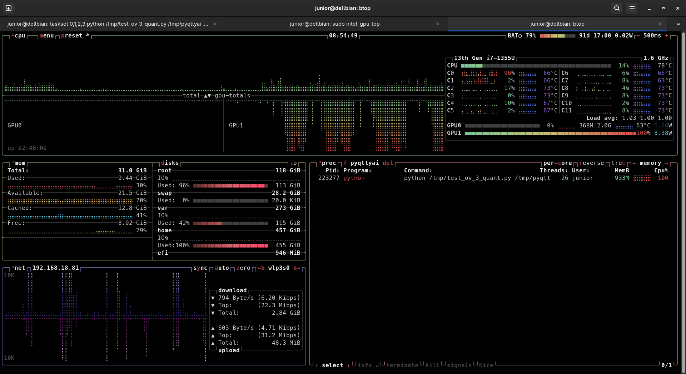

# 🎙️ Whisper Large v3 on Intel Iris Xe — Quantization Benchmark

> **Hardware**: Dell laptop · Intel Core i7-1355U (13th Gen) · Iris Xe iGPU (GPU1) · 32 GB RAM
> **OS**: Debian-based Linux · `btop` monitoring · 500 ms refresh
> **Stack**: `openvino-genai` + `huggingface_hub` + `librosa`
> **Models**: [`OpenVINO/whisper-large-v3-{int4,int8,fp16}-ov`](https://huggingface.co/OpenVINO)
> **Goal**: Compare INT4 / INT8 / FP16 quantization on GPU for ASR (speech recognition)

---

## 💾 Disk footprint

| 📦 Item | Size | Notes |
|---|:-:|---|
| 🐍 `./.venv` | **720 MB** | The whole Python virtual environment (OpenVINO + librosa + deps) |
| 🥇 `./whisper-large-v3-int4-ov` | **825 MB** | Smallest — fits in pocket-sized storage |
| 🥈 `./whisper-large-v3-int8-ov` | **1.5 GB** | About 1.8× INT4 |
| 🥉 `./whisper-large-v3-fp16-ov` | **2.9 GB** | About 3.5× INT4, 1.9× INT8 |

### 📐 Compression ratios

$$
\text{INT8 vs FP16} = \frac{2.9}{1.5} \approx 1.93\times \text{ smaller}
$$

$$
\text{INT4 vs FP16} = \frac{2.9}{0.825} \approx 3.52\times \text{ smaller}
$$

$$
\text{INT4 vs INT8} = \frac{1.5}{0.825} \approx 1.82\times \text{ smaller}
$$

> 💡 **Why it matters**: On a laptop, **disk space, RAM, and download time** are real constraints. INT4 lets you ship **3 different Whisper models in the space of 1 FP16**.

---

## 🎯 Test setup

### 🧵 P-core pinning (`taskset`)

The i7-1355U is a **hybrid CPU**: 2 P-cores (Performance, with Hyper-Threading = 4 threads) + 8 E-cores (Efficient). To prevent the OS from scheduling Python on slow E-cores, we pin to the **first 4 logical CPUs** (the P-core threads):

```bash
taskset 0,1,2,3 python tests/test_ov_3_quant.py /tmp/audio.wav
```

> 💡 Even though inference runs on **GPU1**, the host-side work (audio loading, tokenization, scheduling) still benefits from staying on P-cores.

### 🎮 GPU device selection

The key line in the script:

```python
ov_config = {
    "device": "GPU",   # 🎯 Routes inference to Iris Xe (GPU1)
}
pipe = ov_genai.WhisperPipeline(model_path, **ov_config)
```

Confirmed by `btop`: **GPU1 at 100% / 8.38 W** during inference, while CPU stays around 14% average. ✅

### 🎵 Two audio variants tested

| File | Duration | What it is |
|---|---|---|
| `*_test_ibjkrk0w.wav` | **43.65 s** | 📼 Full raw recording (with silences) |
| `*_test_ibjkrk0w_vad.wav` | **26.21 s** | ✂️ Same audio after **VAD** (Voice Activity Detection) — silences trimmed |

The VAD version is **40% shorter** because non-speech regions were removed.

---

## 📊 Results — Full audio (43.65 s)

| Quant | 💾 Size | 📥 Load (s) | 🧠 Generate (s) | ⏱️ Total/audio (s) | 📝 Quality |
|:-:|:-:|:-:|:-:|:-:|---|
| **INT4** | 825 MB | 4.82 | **6.18** ⚡ | **7.21** 🥇 | Verbose, 4 segments, small typos (`"Noisy"` instead of `"the noise is"`) |
| **INT8** | 1.5 GB | 4.53 | 8.28 | 9.31 | Clean text, 2 segments, accurate |
| **FP16** | 2.9 GB | 5.60 | 8.80 | 9.83 | Identical to INT8, slowest |

**Total run (3 quants)**: 40.30 s

---

## 📊 Results — VAD-trimmed audio (26.21 s)

| Quant | 💾 Size | 📥 Load (s) | 🧠 Generate (s) | ⏱️ Total/audio (s) | 📝 Quality |
|:-:|:-:|:-:|:-:|:-:|---|
| **INT4** | 825 MB | 5.01 | **5.46** ⚡ | **6.54** 🥇 | 3 segments, accurate (`"noise"` correct now!) |
| **INT8** | 1.5 GB | 4.79 | 6.15 | 7.23 | 2 segments, accurate |
| **FP16** | 2.9 GB | 5.93 | 6.67 | 7.76 | Identical to INT8 |

**Total run (3 quants)**: 36.12 s

> 🎯 **VAD shaved ~4 seconds off the total** — and improved INT4 transcription quality.

---

## 🏆 Key findings

### 1️⃣ INT4 is the speed champion ⚡

Across both audios, **INT4 is ~20–40% faster than FP16** on Iris Xe:

$$
\text{speedup}_{\text{INT4 vs FP16}} = \frac{8.80}{6.18} \approx 1.42\times \quad \text{(full audio)}
$$

$$
\text{speedup}_{\text{INT4 vs FP16}} = \frac{6.67}{5.46} \approx 1.22\times \quad \text{(VAD audio)}
$$

### 2️⃣ INT4 is also the disk champion 💾

INT4 wins on **both axes** — speed AND size. That's unusual: typically you trade one for the other. Quantization here is essentially a **free lunch**, with only minor quality cost on noisy audio. 🍱

### 3️⃣ INT8 ≈ FP16 in quality, slightly faster and half the size 🎯

Both produced **identical transcripts** in both runs. INT8 is the **safe production choice** — fp16 quality at half the disk and slightly faster inference.

### 4️⃣ INT4 has minor quality regressions 📉

On the noisy full recording, INT4:
- Wrote `"Noisy"` instead of `"the noise is"`
- Split the transcription into more segments
- Truncated some sentences

> ⚠️ **Trade-off**: INT4 saves time and space but can be less accurate on noisy/long audio. **VAD pre-processing fixes most of these issues.**

### 5️⃣ Real-time factor (RTF) 🚀

$$
\text{RTF} = \frac{\text{processing time}}{\text{audio duration}}
$$

A lower RTF is better. **RTF < 1 means faster than real-time.**

| Audio | Quant | RTF | Interpretation |
|---|:-:|:-:|---|
| Full (43.65 s) | INT4 | **0.14** | 🟢 ~7× faster than real-time |
| Full (43.65 s) | FP16 | 0.20 | 🟢 ~5× faster than real-time |
| VAD (26.21 s) | INT4 | **0.21** | 🟢 ~5× faster than real-time |
| VAD (26.21 s) | FP16 | 0.25 | 🟢 ~4× faster than real-time |

> 💎 An **Iris Xe iGPU** transcribing Whisper Large v3 at **5–7× real-time** is genuinely impressive for a thin laptop. 🪶

---

## 📐 Efficiency score (a fun composite metric)

Combining size and speed in a single number — **lower is better**:

$$
\text{efficiency} = \text{size}_{\text{GB}} \times \text{generate}_{\text{s}}
$$

### Full audio:

| Quant | Size × Time | Score | Rank |
|:-:|:-:|:-:|:-:|
| **INT4** | 0.825 × 6.18 | **5.10** | 🥇 |
| **INT8** | 1.5 × 8.28 | 12.42 | 🥈 |
| **FP16** | 2.9 × 8.80 | 25.52 | 🥉 |

### VAD audio:

| Quant | Size × Time | Score | Rank |
|:-:|:-:|:-:|:-:|
| **INT4** | 0.825 × 5.46 | **4.50** | 🥇 |
| **INT8** | 1.5 × 6.15 | 9.23 | 🥈 |
| **FP16** | 2.9 × 6.67 | 19.34 | 🥉 |

> 📊 **INT4 is ~5× more efficient than FP16** by this combined metric. The math doesn't lie. 🧮

---

## 🌡️ Hardware behavior during the test

<p align="center">  </p>

*📊 `btop` (500 ms refresh) — three terminal tabs: the Python benchmark on the left, `intel_gpu_top` in the middle, and the live dashboard on the right. Notice **GPU1 at 100% / 8.38 W** and the Python process pinned to the first 4 logical CPUs (P-core threads).*

From `btop`:

| Metric | Value | Notes |
|---|---|---|
| 🧠 CPU avg | 14% | P-cores doing audio I/O, E-cores idle ✅ |
| 🌡️ CPU temp | 78°C (C0), 73°C avg | Within safe limits |
| 🎮 **GPU1** | **100% · 8.38 W** | 🔥 Iris Xe fully loaded — proves GPU offload works |
| 🎮 GPU0 | 0% · 6.20 W (idle) | (the integrated UHD on the same die isn't being used) |
| 🧮 RAM (system) | 9.44 / 32.0 GiB | |
| 🐍 Python process | 933 MB · 26 threads | OpenVINO spawns extra threads for scheduling |

> 🎓 **Note**: `intel_gpu_top` (running in another tab) is the canonical way to confirm Iris Xe utilization — `btop` shows it via the GPU1 bar.

---

## 💻 Reproducing the test

### 🔧 Commands used

```bash
# 📁 Both audio variants, pinned to P-cores
taskset 0,1,2,3 python tests/test_ov_3_quant.py /tmp/pyqttyai_test_ibjkrk0w.wav
taskset 0,1,2,3 python tests/test_ov_3_quant.py /tmp/pyqttyai_test_ibjkrk0w_vad.wav
```

### 🐍 What the script does ([`test_ov_3_quant.py`](../tests/test_ov_3_quant.py))

1. 🎵 Loads audio with **librosa** at 16 kHz, float32 (Whisper's required format)
2. 🔁 Loops over `('int4', 'int8', 'fp16')`
3. 📥 Downloads `OpenVINO/whisper-large-v3-{quant}-ov` from HuggingFace
4. 🚀 Builds an `ov_genai.WhisperPipeline` on **GPU**
5. ⚙️ Enables `return_timestamps=True` for segment-level output
6. 🧠 Calls `pipe.generate(audio_list, config)`
7. 📝 Builds an OpenAI-compatible **verbose_json** structure (matches the `whisper-1` API format)
8. ⏱️ Reports load / inference / total times ([results](../tests/result_openvino.txt))

### 📦 Dependencies

```bash
pip install --upgrade \
    "openvino-genai>=2026.0" \
    "huggingface_hub>=0.27" \
    "librosa>=0.10"
```

> ✅ Notice: **no `transformers`, no `optimum-intel`, no `torch`** needed — pure OpenVINO runtime + HF download. Lightweight and reliable. 🪶
> 📊 The whole `.venv` is **720 MB**, which is roughly the size of the FP16 model + INT8 model combined. Most of it is OpenVINO + librosa's audio dependencies (numba, scipy, soundfile).

---

## 🧮 Storage planning cheatsheet

If you want to ship multiple Whisper variants on a device:

| Scenario | Disk needed | Comment |
|---|:-:|---|
| 🪶 Minimal (INT4 only) | ~825 MB + 720 MB venv ≈ **1.6 GB** | Fits easily |
| ⚖️ Balanced (INT4 + INT8) | ~2.3 GB + 720 MB ≈ **3.0 GB** | INT4 for speed, INT8 fallback for tricky audio |
| 🎯 Full set (all 3 quants) | ~5.2 GB + 720 MB ≈ **5.9 GB** | Useful for benchmarking, not production |
| 🚫 FP16-only legacy | ~2.9 GB + 720 MB ≈ **3.4 GB** | Bigger than INT8 with same quality — avoid |

> 💎 **Recommendation for production**: Ship **INT8** as default, **INT4** as a "fast mode" toggle. Skip FP16 entirely — INT8 matches its quality at half the size.

---

## 🧪 Suggested next experiments

| 🔬 Experiment | Why it matters |
|---|---|
| 🆚 Run the same script with `"device": "CPU"` to compare CPU vs GPU on the **same machine** | Quantifies the Iris Xe speedup |
| 🌍 Test with Portuguese audio + `config.language = "<\|pt\|>"` | Validates multilingual quality |
| 🎛️ Try `"device": "AUTO"` and `"device": "HETERO:GPU,CPU"` | OpenVINO can split work between devices |
| 📏 Test smaller models: `whisper-base`, `whisper-small`, `whisper-medium` | Find the quality/speed sweet spot |
| 🔁 Average **5 runs per quant** (discard the first as warm-up) | Current numbers include cold-start variability |
| 🧊 Cache the pipeline across runs (avoid 4–6 s reload per quant) | Move `WhisperPipeline()` outside the loop |
| 📡 Streaming mode with `pipe.generate(..., streamer=...)` | Real-time partial transcripts |
| 📉 Measure **WER** (Word Error Rate) against a ground-truth transcript | Quantify the quality gap precisely |

---

## 🎓 What this proves

✅ **OpenVINO GenAI works perfectly on Iris Xe** — no driver hell, no manual conversion
✅ **Pre-converted models from `OpenVINO/*` on HuggingFace are production-ready**
✅ **INT4 quantization is a free lunch** here: faster AND smaller, with only minor quality cost
✅ **The same approach scales to LLMs** — exactly the path used for Qwen3-30B-A3B 🎯
✅ **A thin laptop iGPU does 5–7× real-time Whisper Large v3** at ~8 W 🪶🌱

---

## 📚 References

- 🤗 [OpenVINO HuggingFace org](https://huggingface.co/OpenVINO)
- 📖 [OpenVINO GenAI documentation](https://docs.openvino.ai/2026/openvino-workflow-generative.html)
- 🎙️ [Whisper paper (OpenAI)](https://arxiv.org/abs/2212.04356)
- 🧮 [NNCF quantization guide](https://github.com/openvinotoolkit/nncf)

---

*Benchmark by Claudio Polegato Junior · Ribeirão Preto, BR · May 2026*
